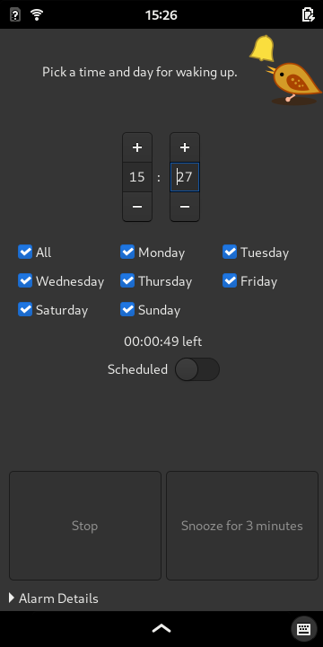

# Birdie
Alarm app designed for Linux phones.

Tested with PINE64 PinePhone running Phosh.



Open [Screenshots Gallery](./screenshots/README.md) for more images.

## Features
- system wakes up from power saving mode (suspend) to play the alarm
- single alarm schedule
- alarm is repeated for selected days of the week
- snooze button
- pleasant wake up sound (included)
- gradual volume increase of the alarm
- alarm test mode
- alarm accessible from a lockscreen (via MPRIS)


## Install from source:

```
# on Mobian/Debian:
sudo apt install gcc make checkinstall
make install-deb

# or generic:
pip3 install mpris_server
make install
```

See [mpris_server](https://github.com/alexdelorenzo/mpris_server) for installation details. Or disable it in `birdie` via `USE_MPRIS = False`.

## Uninstall:

```
# on Mobian/Debian:
sudo dpkg -r birdie

# or generic:
make uninstall
```

# Notes
Forked from [Wake Mobile](https://gitlab.gnome.org/kailueke/wake-mobile), a proof-of-concept alarm app that uses systemd timers to wake up the system.

Logo icon adapted from [freesvg.org #1](https://freesvg.org/1526107263) and [freesvg.org #2](https://freesvg.org/1552814098) (Public Domain).

Alarm sound is a custom recording, released into Public Domain.
