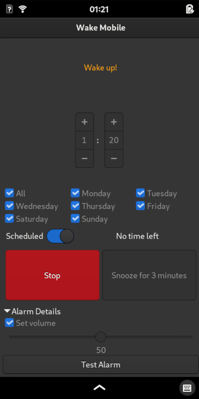

# Wake Mobile

Proof-of-concept alarm app that uses systemd timers to wake up the system

The user needs to be logged in. Meant to be used with Phosh where this is always the case and where the system suspends after inactivity.

A setuid helper binary is used to write systemd timer drop-in unit files for the user because only system timers can wake the system up from suspend.



## Binary packages for Mobian/Debian

You can download the packages [here](https://gitlab.gnome.org/kailueke/wake-mobile/-/tags/1.5).

On the PinePhone download the arm64 deb and install it with `sudo apt install $(ls ./wake-mobile_*_arm64.deb | sort | tail -n 1)`.

## Installation from source:

```
# on Mobian/Debian:
sudo apt install gcc make checkinstall
make install-deb

# or generic:
make install
```

## Deinstallation:

```
# on Mobian/Debian:
sudo dpkg -r wake-mobile

# or generic:
make uninstall
```


History: I wrote this originally for the OpenMoko where it relied on calling `rtcwake` through `pkexec` and now adapted it to show how GNOME Clocks could make use systemd timers.
