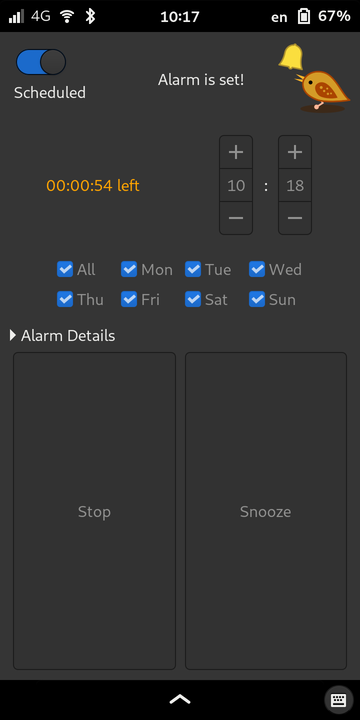
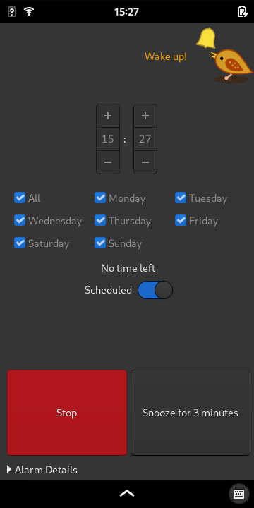
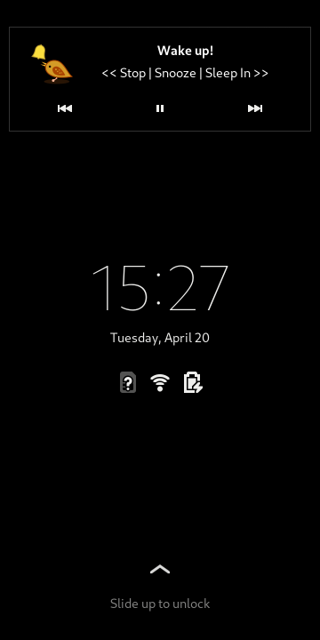
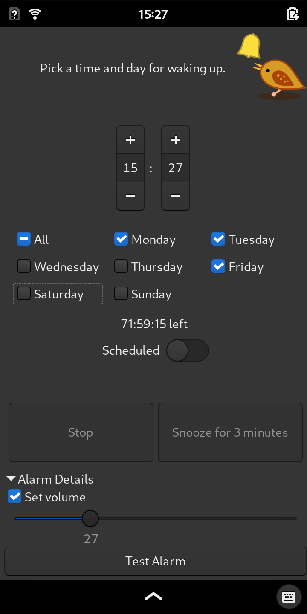

# App Screenshots
Following is a gallery of functionality of the alarm app.

## Home Screen
Simple initial screen: set the time, enable, done!

## Alarm Set and Waiting
Alarm is scheduled, settings are locked. Countdown to the alarm is shown.

## Alarm Ringing
### App
The app is auto-started when the alarm is scheduled to ring.

### Lockscreen
Alarm can be stopped or snoozed directly from the lock screen, no need to log in!

## Customization
Select different days, change the maximum alarm volume.

